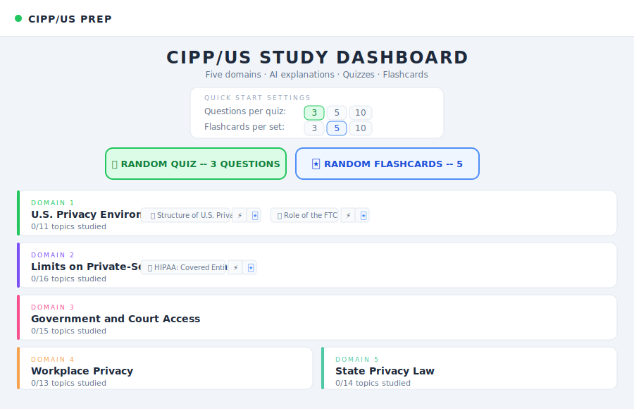
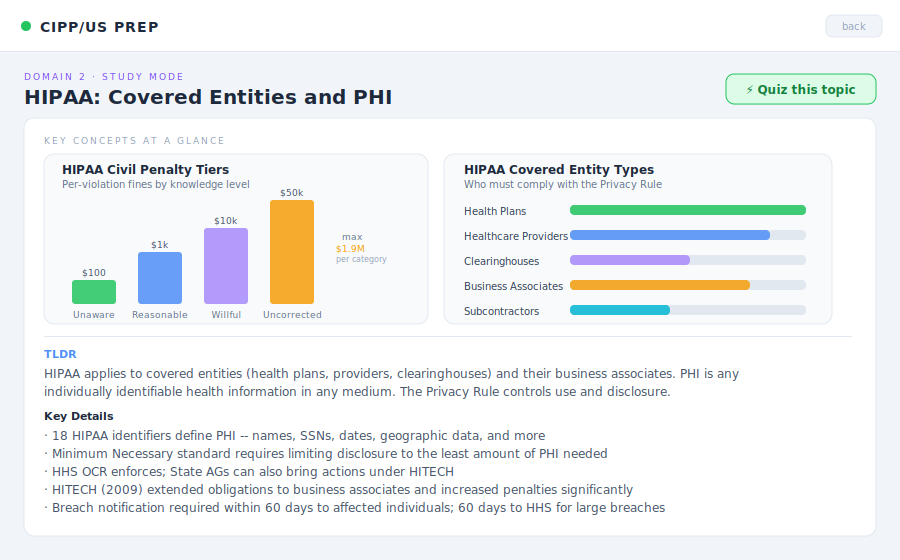
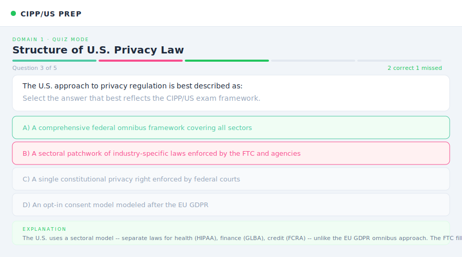
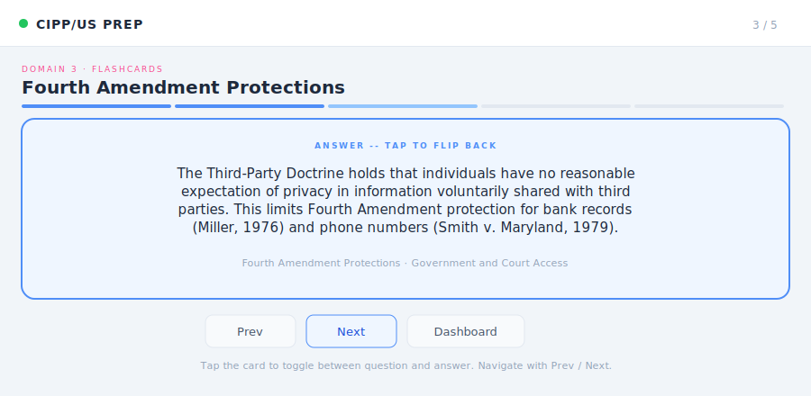

# CIPP/US Study App

An AI-powered study tool for the IAPP CIPP/US (Certified Information Privacy Professional) exam. Covers all five exam domains with three study modes: AI explanations with visual charts, multiple-choice quizzes, and flip-style flashcards. All content is generated on demand by Claude Sonnet.

Built as a single React component. No backend required beyond the Anthropic API.

---

## Screenshots

### Study Dashboard



The home screen shows all five CIPP/US domains. Configure your session with the Quick Start Settings panel at the top, then launch a random quiz or random flashcard set with one click. Each topic row has three buttons: study (AI explanation), quiz (multiple choice), and flashcard.

---

### Study Mode with AI Charts



Selecting a topic generates a full AI explanation prefaced by 2 to 3 auto-generated charts. Charts pull real statutory data such as penalty tiers, enforcement agency breakdowns, and coverage thresholds. The chart type (bar, horizontal bar, or pie) is chosen by the AI based on what best fits the data. The markdown explanation appears below.

---

### Quiz Mode



Multiple-choice questions are generated per topic or across random topics. After selecting an answer, the correct option highlights green, any wrong selection highlights red, and an explanation appears immediately. A progress bar at the top tracks correct and incorrect answers across the session.

---

### Flashcard Mode



Tap any card to flip between the question and answer. Navigate with Prev and Next. Flashcards are available per topic (from the topic buttons on the dashboard) or as a random cross-domain set. A New Set button at the end regenerates a fresh random deck.

---

## Domains Covered

| # | Domain | Topics |
|---|--------|--------|
| 1 | U.S. Privacy Environment | 11 topics |
| 2 | Limits on Private-Sector Collection | 16 topics |
| 3 | Government and Court Access | 15 topics |
| 4 | Workplace Privacy | 13 topics |
| 5 | State Privacy Law | 14 topics |

Key statutes covered include HIPAA, HITECH, GLBA, FCRA, COPPA, FERPA, ECPA, FISA, PATRIOT Act, CFAA, CCPA/CPRA, BIPA, and more.

---

## Tech Stack

- React 18 with hooks
- Anthropic Claude Sonnet via `/v1/messages`
- Recharts for bar, horizontal bar, and pie visualizations
- No build step required for the artifact version

---

## Running in Claude.ai

This app is designed to run as a React artifact in Claude.ai. Paste the contents of `src/App.jsx` into a new artifact and it will run immediately using the built-in Anthropic API access.

## Running Locally

```bash
git clone https://github.com/nale808/cipp-us-study-app-artifact.git
cd cipp-us-study-app-artifact
npm install
npm run dev
```

You will need an Anthropic API key set as `VITE_ANTHROPIC_API_KEY` in a `.env` file.

---

## Project Structure

```
cipp-us-study-app-artifact/
├── src/
│   └── App.jsx          # Full app in a single component
├── screenshots/
│   ├── 01-dashboard.svg
│   ├── 02-study-mode.svg
│   ├── 03-quiz-mode.svg
│   └── 04-flashcard-mode.svg
└── README.md
```

---

## Notes

Content is generated fresh on each request by Claude Sonnet. Quiz questions, study explanations, and flashcards are not cached, so every session produces new material. The app tracks per-topic quiz scores in session state and displays a running percentage in the header.
